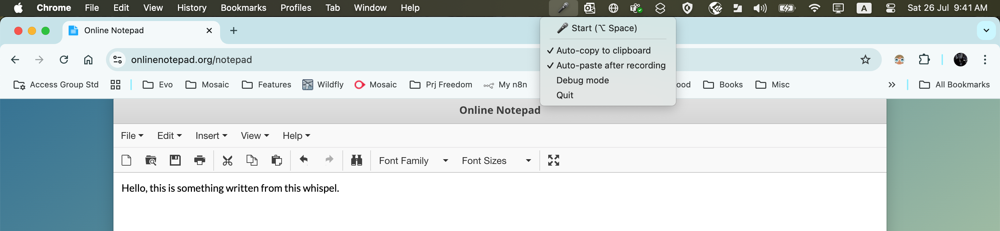

# Voice Transcriber 🎤

A macOS menu bar application for real-time speech-to-text transcription with automatic clipboard copying and pasting.



## Features

- **Menu bar app**: Clean single microphone icon in your menu bar
- **Global hotkey**: ⌥ Space to start/stop recording from anywhere
- **High-quality transcription**: Powered by MLX parakeet model with complete audio processing
- **Auto-copy & paste**: Automatically copies to clipboard and pastes into active app
- **Smart cleanup**: Removes filler words ("uh", "hmm") from end of transcripts
- **1-minute timeout**: Automatic recording stop with safety limit
- **Enhanced audio recording**: Stream callback mode with 44.1kHz quality
- **Debug mode**: Save audio files for troubleshooting
- **Minimal interface**: Just the essentials, nothing cluttered

## Installation

### Prerequisites
- macOS (required for menu bar functionality)
- Python 3.8+
- Microphone access permission

### Install Dependencies

```bash
pip install -r requirements.txt
```

Or install manually:
```bash
pip install pyaudio pyperclip numpy parakeet_mlx rumps pynput
```

### Permissions Required

The app will request the following permissions:
1. **Microphone access** - For recording audio
2. **Accessibility access** - For simulating keyboard shortcuts (auto-paste)

macOS will prompt you to grant these permissions when first running the app.

## Usage

### Basic Usage

```bash
# Start the application
python voice_transcriber.py
```

The microphone icon (🎤) will appear in your menu bar.

### Recording Methods

**Method 1: Global Hotkey (Recommended)**
- Press `⌥ Space` to start recording
- Speak your text
- Press `⌥ Space` again to stop
- Text automatically appears in the active application

**Method 2: Menu Bar Click**
- Click the 🎤 icon to start recording
- Click the 🔴 icon to stop recording

### Recording Flow

1. **Start**: 1-second countdown, then recording begins immediately
2. **Recording**: Icon shows 🔴, speak clearly (auto-stops after 1 minute)
3. **Stop**: 1-second buffer to capture trailing words
4. **Processing**: Complete audio transcribed for best quality
5. **Auto-paste**: Text automatically copied to clipboard and pasted

### Command Line Options

```bash
# Show help
python voice_transcriber.py --help

# Show debug directory information
python voice_transcriber.py --debug-info
```

### Menu Options

Right-click the menu bar icon to access:

- **✓ Auto-copy to clipboard** - Automatically copy transcribed text (enabled by default)
- **✓ Auto-paste after recording** - Automatically paste after transcription (enabled by default)
- **Debug mode** - Save audio files for troubleshooting (disabled by default)
- **Quit** - Exit the application

## Configuration

### Auto-copy
- **Enabled by default**: Transcribed text is automatically copied to clipboard
- **Toggle**: Uncheck in menu to disable

### Auto-paste
- **Enabled by default**: After transcription, simulates Cmd+V to paste text
- **Toggle**: Uncheck in menu to disable
- **Requirements**: Target application must be focused for paste to work

### Debug Mode
- **Disabled by default**: Audio files are deleted after transcription
- **When enabled**: Audio files are saved to a debug directory
- **View location**: Run `python voice_transcriber.py --debug-info`

## Troubleshooting

### App doesn't appear in menu bar
- Make sure you have the required permissions
- Check that rumps is properly installed
- Try running from terminal to see error messages

### Microphone not working
- Grant microphone permission in System Preferences → Security & Privacy → Privacy → Microphone
- Check your default microphone in System Preferences → Sound → Input

### Auto-paste not working
- Grant accessibility permission in System Preferences → Security & Privacy → Privacy → Accessibility
- Make sure the target application is focused when recording stops
- Check that auto-paste is enabled in the menu

### Transcription quality issues
- Speak clearly and at normal volume
- Reduce background noise
- Check microphone levels in System Preferences
- Enable debug mode to save audio files for analysis

### Global hotkey not working
- Make sure no other app is using ⌥ Space
- Try restarting the application
- Check terminal output for hotkey initialization messages
- If pynput compatibility issues occur, use menu bar instead

## Technical Details

- **Model**: MLX parakeet-tdt-0.6b-v2 for transcription
- **Audio quality**: 44.1kHz sample rate with stream callback processing
- **Recording timeout**: 1-minute safety limit with automatic stop
- **Audio processing**: Complete audio transcription for best quality
- **Timing**: 1s start countdown, 1s end buffer (improved responsiveness)
- **Cleanup**: Removes trailing filler words (uh, um, hmm, ah, er, eh)
- **Hotkey**: ⌥ Space (global, works from any application)

## Building Standalone App

To create a standalone macOS app bundle:

### Prerequisites for Building
```bash
pip install pyinstaller
```

### Build Process
```bash
# Auto-generate spec file and build app
python build.py
```

This will:
1. Automatically detect your MLX/parakeet installation paths
2. Generate `Whispel.spec` with correct paths for your environment
3. Build the standalone app bundle at `dist/Whispel.app`

### Manual Build (Advanced)
If the automated build script doesn't work:

1. **Generate spec file from template**:
   ```bash
   # Find your package paths
   python -c "import parakeet_mlx; print(parakeet_mlx.__path__[0])"
   python -c "import mlx; print(mlx.__path__[0])"
   
   # Edit Whispel.spec.template and replace {{PARAKEET_MLX_PATH}} and {{MLX_PATH}}
   # Save as Whispel.spec
   ```

2. **Build with PyInstaller**:
   ```bash
   pyinstaller Whispel.spec
   ```

### Build Files
- `Whispel.spec.template` - Template for PyInstaller spec file
- `build.py` - Automated build script
- `pyi_rth_mlx.py` - Runtime hook for MLX libraries (essential for bundled app)

**Note**: `Whispel.spec` is not checked into version control as it contains environment-specific paths.

## Development

### File Structure
- `voice_transcriber.py` - Main application
- `voice_transcriber_debug.py` - Debug version with extensive logging
- `audio_recorder.py` - Audio recording functionality  
- `requirements.txt` - Python dependencies
- `build.py` - Automated build script for standalone app
- `Whispel.spec.template` - PyInstaller spec file template
- `pyi_rth_mlx.py` - PyInstaller runtime hook for MLX
- `README.md` - This documentation

### Contributing
1. Fork the repository
2. Create a feature branch
3. Make your changes
4. Test thoroughly on macOS
5. Test the build process with `python build.py`
6. Submit a pull request

## License

[Add your license here]

## Support

For issues and questions:
1. Check the troubleshooting section above
2. Enable debug mode and check audio files
3. Run with `python voice_transcriber.py --debug-info`
4. [Add your support contact/GitHub issues link]